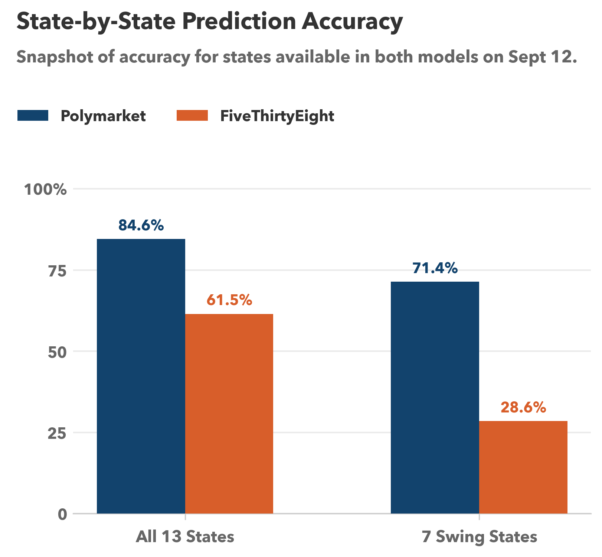
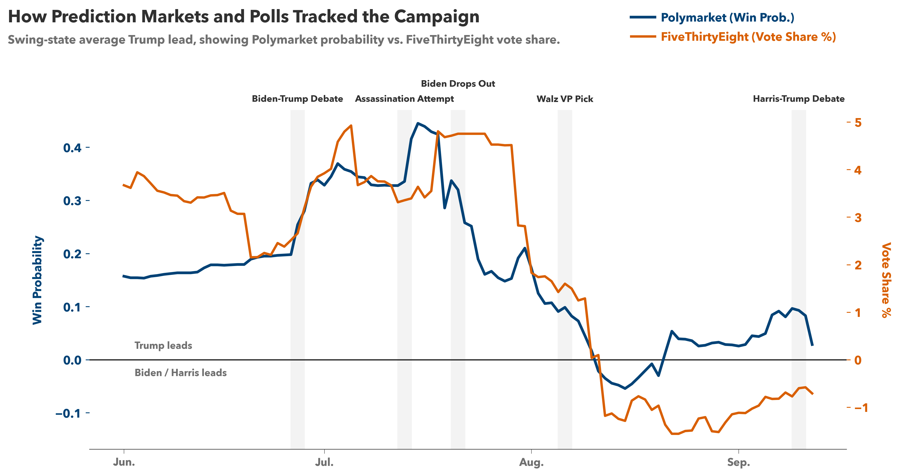

# Markets vs. Polls:
# Forecasting the 2024 U.S. Presidential Election

This project compares **Polymarket** prediction-market prices with **FiveThirtyEight** polling averages to evaluate how each source forecast the 2024 U.S. presidential election. We study two questions: which source more accurately predicted certified election outcomes, and which source reacted more usefully to major campaign events. Across the full March 8 to September 12 overlap period, FiveThirtyEight was more accurate on average. But in the late campaign window, Polymarket adapted faster, performed better in the final September 12 head-to-head snapshot, and responded more accurately to the major events analyzed here.

## Main Findings

- On the final common date between both sources, **Polymarket correctly called 11 of 13 overlap states**, while **FiveThirtyEight correctly called 8 of 13**.
- In the **7 swing states**, Polymarket went **5 for 7** and FiveThirtyEight went **2 for 7**.
- Over the **full March 8 to September 12 overlap period**, average daily accuracy was **74.9% for Polymarket** and **90.2% for FiveThirtyEight**.
- In the **late period from August 1 to September 12**, the relationship flipped: **Polymarket averaged 79.2% daily accuracy** and **FiveThirtyEight averaged 62.2%**.
- In the event-response analysis, **Polymarket moved in the expected direction in 4 of 5 events**, while **FiveThirtyEight did so in 3 of 5**.



*Figure 1. Snapshot accuracy on September 12, 2024, the final date available in both sources. On the last common date, Polymarket made more correct state calls overall and in the swing-state subset.*

## Research Questions

1. Which source more accurately predicted actual election outcomes?
2. How did prediction markets and polls react to major campaign events, and which source told the more accurate story?

## Data Sources

The project combines market data, polling data, certified election results, and a hand-built event timeline.

| Source | What it provides | Coverage used here | Link |
|---|---|---|---|
| **Polymarket** | State-level win probabilities | Daily, hourly, and minutely state series | [Kaggle](https://www.kaggle.com/datasets/pbizil/polymarket-2024-us-election-state-data) |
| **FiveThirtyEight** | State polling averages by candidate vote share | State-level polling averages through **2024-09-12** | [GitHub](https://github.com/fivethirtyeight/data/blob/master/polls/2024-averages/presidential_general_averages_2024-09-12_uncorrected.csv) |
| **FEC official results** | Certified state vote totals and winners | State-level ground truth | [fec.gov](https://www.fec.gov/documents/5645/2024presgeresults.xlsx) |
| **Campaign events timeline** | Dates for major race-changing events | Five-event event-study input | [US News](https://www.usnews.com/news/national-news/articles/2024-10-30/the-moments-that-defined-the-2024-presidential-election) |

Because FiveThirtyEight coverage ends on **September 12, 2024**, that date defines the fair head-to-head comparison window. Polymarket continues beyond that date, so later Polymarket-only results are reported separately.

## Method Overview

The analysis has four parts:

- **Winner-call accuracy:** compare each source's predicted winner by state against certified FEC outcomes.
- **Electoral-vote comparison:** map predicted state winners to electoral votes to compare implied Electoral College totals.
- **Daily overlap-period accuracy:** measure how each source performed day by day from March 8 to September 12.
- **Event-response analysis:** evaluate the direction and timing of market and poll reactions around five major campaign events.

## Event Response

The event analysis focuses on five major campaign moments: the Biden-Trump debate, the assassination attempt against Trump, Biden's withdrawal, Walz's VP selection, and the Harris-Trump debate. For each event, the project compares the change in swing-state average Trump lead before and after the event.



*Figure 2. Event-response timeline for Polymarket and FiveThirtyEight across the major campaign shocks in the shared analysis window. The two series are plotted on separate y-axes, so this figure should be read as a comparison of direction and timing rather than a direct comparison of magnitudes.*

## Repository Layout

```text
data/
  processed/              cleaned datasets used in analysis
  raw/                    source inputs
src/
  clean/                  raw-to-processed data cleaning scripts
  analysis/accuracy/      outcome-accuracy analysis and output
  analysis/events/        event-response analysis and output
  visualize/              figure-generation scripts
figures/
  accuracy/               saved accuracy figures
  events/                 saved event figures
notebooks/                exploratory notebooks
```

## Reproducing the Analysis

Install dependencies:

```bash
pip install -r requirements.txt
```

Run the full workflow from the project root:

```bash
python -m src.clean.run_all
python -m src.analysis.accuracy
python -m src.analysis.events.event_response
python -m src.visualize.accuracy_plots
python -m src.visualize.event_plots
```

These commands regenerate the processed datasets, analysis text outputs, and saved figures used throughout the project.

## Outputs

- Accuracy analysis text output: [`src/analysis/accuracy/result.txt`](src/analysis/accuracy/result.txt)
- Event-response text output: [`src/analysis/events/result.txt`](src/analysis/events/result.txt)
- Accuracy figures: [`figures/accuracy/`](figures/accuracy/)
- Event figures: [`figures/events/`](figures/events/)

## Limitations

- **Prediction markets are not the electorate.** Polymarket reflects trader beliefs and incentives, which may differ from the voting population.
- **Polling coverage is truncated.** FiveThirtyEight data ends on September 12, so direct head-to-head comparisons cannot extend into the final stretch of the campaign.
- **The event list is curated.** The timeline of major events is hand-selected, which introduces judgment into what counts as a meaningful campaign shock.
